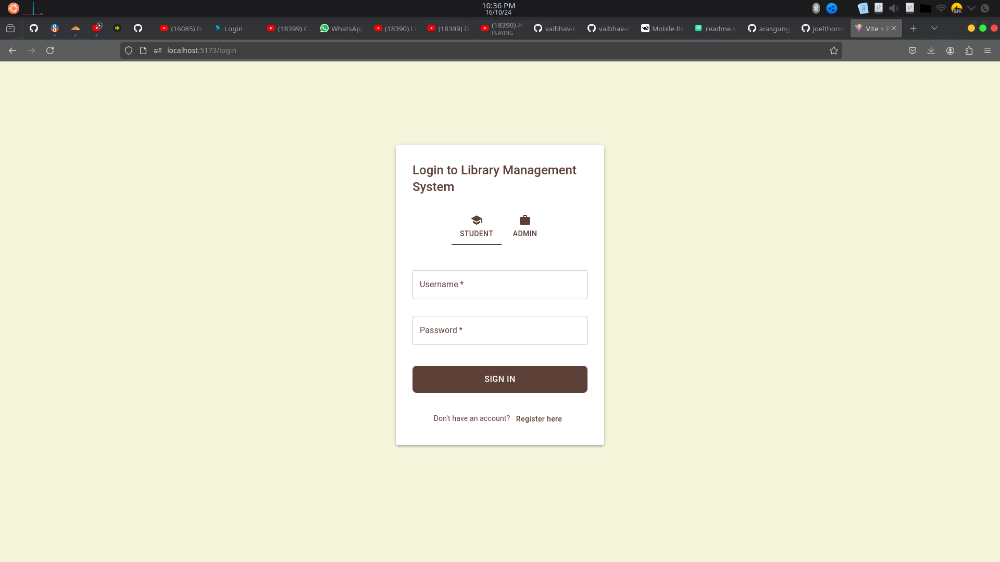
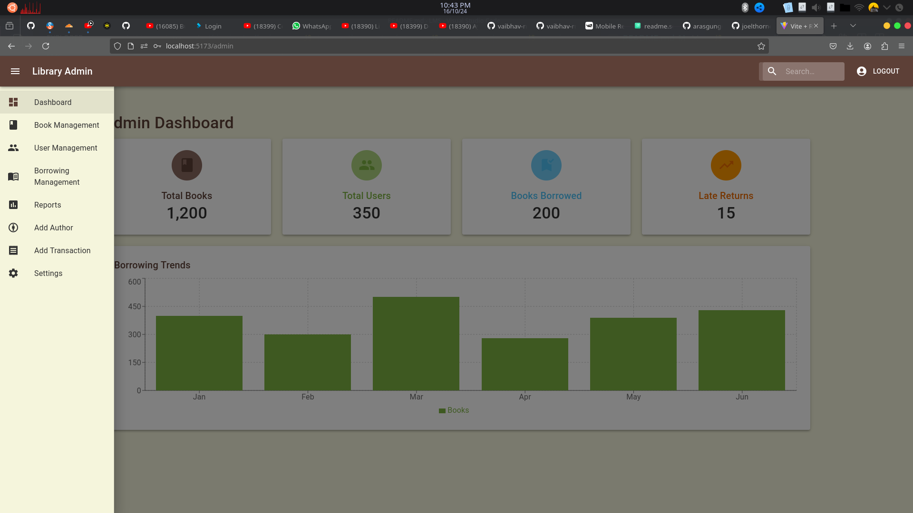
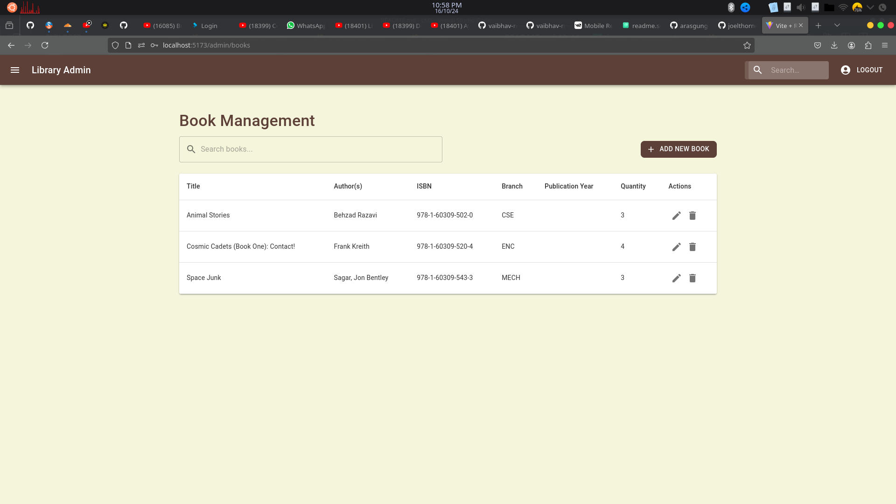
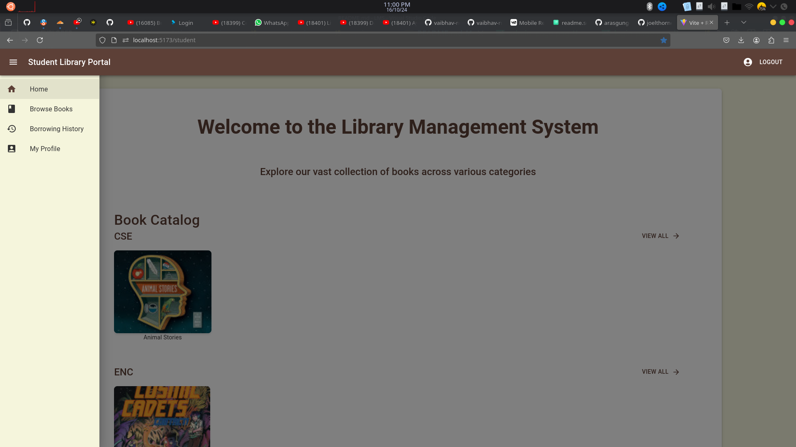
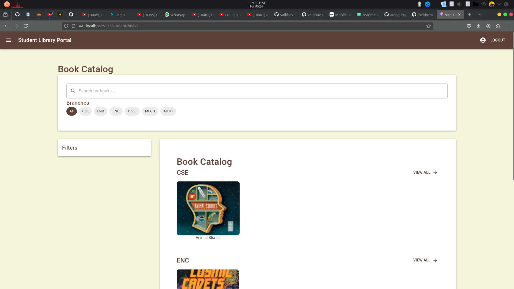

# Library Management System

## Project Overview

This project is a Library Management System built using React for the frontend and Node.js for the backend. It allows users to manage books, users, and lending processes efficiently.

## Tech Stack

- **Frontend:** React, Vite, TailWindCss
- **Backend:** Node.js, Express
- **Database:** MongoDB 

## Getting Started

### Prerequisites

- Node.js installed on your machine
- npm (Node Package Manager) should be included with Node.js

### Installation

1. Clone the repository:

   ```bash
   git clone https://github.com/vaibhav-rm/Library-management-system.git
   cd Library-management-system
   ```

2. Install dependencies for the frontend:

   ```bash
   npm install
   ```

3. Install dependencies for the backend:

   ```bash
   cd backend
   npm install
   ```

### Running the Application

#### Frontend

To run the frontend, use the following command (by default runs at `http://localhost:8000`):

```bash
npm run dev
```

This will start the Vite development server, and you can access the application at `http://localhost:5173`.

#### Backend

To run the backend, first, navigate to the backend directory:

```bash
cd backend
```

Then, run the following command:

```bash
npm run dev
```

This will start the Node.js server, and you can access the API endpoints as specified in the backend code.

## Features

- User authentication (login/register)
- Book management (add, remove, update, view)
- User management (add, remove, update, view)
- Lending management (track borrowed books, due dates, etc.)

## Contributing

If you want to contribute to this project, feel free to fork the repository and submit a pull request.

## License

This project is licensed under the MIT License. See the LICENSE file for more details.

## Screenshots



### Admin Login




### Student Login




## API Reference

#### Api url

```http
 http://localhost:8000/api/v1/{ENDPOINT}
```

| Parameter | Type     | Description                |
| :-------- | :------- | :------------------------- |
| `ENDPOINT` | `string` | **Required**. which resoruce you want to use |

## For more information visit Project Documentation

 - [LMS Documentation]()
 - [Api Documentation]()

## Acknowledgements

- [React](https://reactjs.org/)
- [Node.js](https://nodejs.org/)
- [MongoDB](https://www.mongodb.com/)
